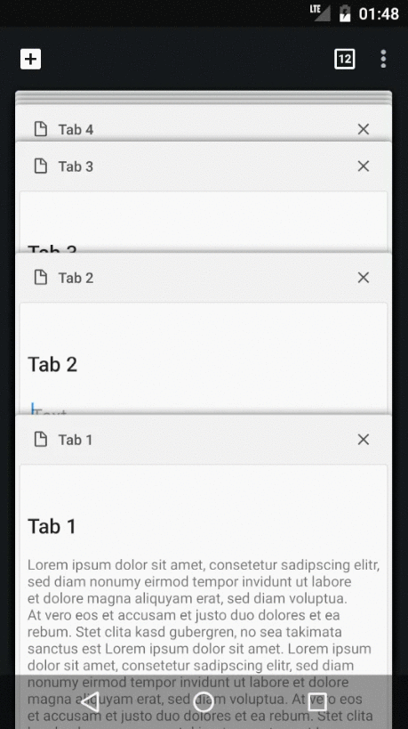
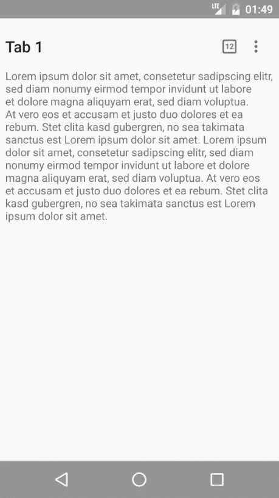

# ChromeLikeTabSwitcher - README

*THIS LIBRARY IS STILL WORK IN PROGRESS. THE LAYOUT OPTIMIZED FOR TABLETS IS NOT IMPLEMENTED YET.*

"ChromeLikeTabSwitcher" is an Android-library, which provides a tab switcher similar to the one, which is used in the Android version of Google's Chrome browser. It provides layouts optimized for smartphone and tablet devices. The following GIFs illustrate the appearance of the library:


The library provides the following features:

- Provides layouts optimized for smartphones and tablets.
- Tabs can dynamically be added and removed either programmatically or by using the UI. Different types of animations are available for said purpose.
- The tab switcher's state is automatically restored on configuration changes.
- In order to provide great performance, views are automatically recycled and and the previews of tabs are rendered as bitmaps.
- The apperance of tabs, e.g. their background or title color, can be customized.
 
## License Agreement

This project is distributed under the Apache License version 2.0. For further information about this license agreement's content please refer to its full version, which is available at http://www.apache.org/licenses/LICENSE-2.0.txt.

## Download

The latest release of this library can be downloaded as a zip archive from the download section of the project's Github page, which is available [here](https://github.com/michael-rapp/ChromeLikeTabSwitcher/releases). Furthermore, the library's source code is available as a Git repository, which can be cloned using the URL https://github.com/michael-rapp/ChromeLikeTabSwitcher.git.

Alternatively, the library can be added to your Android app as a Gradle dependency by adding the following to the respective module's `build.gradle` file:

```groovy
dependencies {
    compile 'com.github.michael-rapp:chrome-like-tab-switcher:0.1.0'
}
```

## Examples

The library's tab switcher is implemented as a custom view `TabSwitcher`. It can be added to an activity or fragment by being declared programmatically or via a XML resource. The following XML code shows how the view can be added to a XML layout resource. A tab switcher should typically be shown fullscreen by setting the attributes `layout_width` and `layout_height` to `match_parent`. Furthermore, the view provides various custom attributes for customizing its appearance, which can as well be seen in the given example. 

```xml
<?xml version="1.0" encoding="utf-8"?>
<de.mrapp.android.tabswitcher.TabSwitcher android:id="@+id/tab_switcher"
                                          xmlns:android="http://schemas.android.com/apk/res/android"
                                          xmlns:custom="http://schemas.android.com/apk/res-auto"
                                          android:layout_width="match_parent"
                                          android:layout_height="match_parent"
                                          android:background="@color/tab_switcher_background_color"
                                          custom:layoutPolicy="auto"
                                          custom:tabIcon="@drawable/ic_file_outline_18dp"
                                          custom:tabBackgroundColor="@color/tab_background_color"
                                          custom:tabTitleTextColor="@color/tab_title_text_color"
                                          custom:tabCloseButtonIcon="@ic_close_18dp"
                                          custom:toolbarTitle="@string/tab_switcher_toolbar_title"
                                          custom:toolbarMenu="@menu/tab_switcher_toolbar_menu"
                                          custom:toolbarNavigationIcon="@drawable/ic_add_box_white_24dp"/>
```

When instantiating a `TabSwitcher` programmatically, the following Java code can be used. For all XML attributes shown in the example above, corresponding setter methods are available. 

```java
TabSwitcher tabSwitcher = new TabSwitcher(context);
tabSwitcher.setBackground(ContextCompat.getColor(context, R.color.tab_switcher_background_color);
tabSwitcher.setLayoutPolicy(LayoutPolicy.AUTO);
tabSwitcher.setTabIcon(R.drawable.ic_file_outline_18dp);
tabSwitcher.setTabBackgroundColor(ContextCompat.getColor(context, R.color.tab_background_color);
tabSwitcher.setTabTitleTextColor(ContextCompat.getColor(context, R.color.tab_title_text_color);
tabSwitcher.setTabCloseButtonIcon(R.drawable.ic_close_18dp);
tabSwitcher.setToolbarTitle(context.getString(R.string.tab_switcher_toolbar_title));
tabSwitcher.inflateToolbarMenu(R.menu.tab_switcher_toolbar_menu, null);
tabSwitcher.setToolbarNavigationIcon(R.drawable.ic_add_box_white_24dp, null);
```

The tabs, which are contained by a `TabSwitcher` are represented by instances of the class `Tab`. The following Java code demonstrates, how a new tab can be created and added to a tab switcher. By setting a custom icon, background color, title color etc., the defaults, which are applied to the `TabSwitcher` can be overridden for that particular tab. The `setParameters`-method allows to associate a tab with a `Bundle`, which may contain additional information about the tab. By implementing the interface `Tab.Callback` and registering an instance at a `Tab` by using its `addCallback`-method, it can be observed, when the properties of a tab has been changed.   

```java
Tab tab = new Tab("Title");
tab.setCloseable(true);
tab.setIcon(R.drawable.ic_file_outline_18dp);
tab.setBackgroundColor(ContextCompat.getColor(context, R.color.tab_background_color));
tab.setTitleTextColor(ContextCompat.getColor(context, R.color.tab_title_text_color));
tab.setParameters(new Bundle());
tab.addCallback(new Tab.Callback() { /* ... */ });
tabSwitcher.addTab(tab);
```

In order to specify how the tabs of a `TabSwitcher` should look like, the abstract class `TabSwitcherDecorator` must be overridden and an instance of the implementing class must be applied to the tab switcher by using its `setDecorator`-method. This is very similar to the paradigm of adapters commonly used in Android developing for populating a `ListView`, `RecyclerView`, etc. Each custom implementation of the class `TabSwitcherDecorator` must override the `onInflateView`- and `onShowTab`-method. The first one is used to inflate the view, which should be used by a tab, the latter allows to customize the appearance of the inflated view, depending on the current state. If different views should be inflated for different tabs, the `getViewTypeCount`- and `getViewType`-methods must be overridden as well. The first one should return the total number of different views, which are inflated by the `onInflateView`-method, the latter one must return a distinct integer value, which specifies the view type of a specific tab. The following code illustrates how the class `TabSwitcherDecorator` can be implemented.

```java
class Decorator extends TabSwitcherDecorator {

    @NonNull
    @Override
    public View onInflateView(@NonNull LayoutInflater inflater,
                              @Nullable ViewGroup parent, int viewType) {
        if (viewType == 0) {
            return inflater.inflate(R.layout.tab_view_1, parent, false);
        } else {
            return inflater.inflate(R.layout.tab_view_2, parent, false);
        }
    }

    @Override
    public void onShowTab(@NonNull Context context, @NonNull TabSwitcher tabSwitcher, 
                          @NonNull View view, @NonNull Tab tab, int index, int viewType,
                          @Nullable Bundle savedInstanceState) {
        if (viewType == 0) {
            TextView textView = findViewById(R.id.text_view);
            textView.setText(tab.getTitle());
        } else {
            Button button = findViewById(R.id.button);
            button.setText(tab.getTitle());
        }
    }

    @Override
    public int getViewTypeCount() {
        return 2;
    }

    @Override
    public int getViewType(@NonNull Tab tab, int index) {
        Bundle parameters = tab.getParameters();
        return parameters != null ? parameters.getInt("view_type") : 0;
    }

}
```

In order to apply a decorator to a `TabSwitcher` its `setDecorator`-method must be used as shown below. If no decorator has been set, an `IllegalStateException` will be thrown as soon as the view should become visible.

```java
tabSwitcher.setDecorator(new Decorator());
```

In order to observe the state of a `TabSwitcher`, the interface `TabSwitcherListener` listener can be implemented. The interface provides methods, which are invoked, when tabs are added to or removed from a tab switcher, or if the tab switcher has been hidden or shown (only when using the smartphone layout). Instances of the type `TabSwitcherListener` can be added by using a `TabSwitcher`'s `addListener`-method. In order to observe, when the close button of a tab has been clicked, the interface `TabCloseListener` can be implemented and added by using the `addTabCloseListener`-method accordingly.  

## Using Animations

The class `TabSwitcher` provides various methods to add or remove one or several tabs. If the tab switcher is currently shown, tabs are added or removed in an animated manner. In order to use custom animations, an instance of the class `Animation` can be passed to the methods.

### Swipe Animation

When using the smartphone layout, a `SwipeAnimation` is used to add or remove tabs by default. It causes tabs to be swiped horizontally (or vertically in landscape mode). By specifying a value of the enum `SwipeAnimation.SwipeDirection`, it can be specified, whether the tab should be moved to/from the left or right (respectively to/from the top or bottom in landscape mode). The following code sample illustrates how instances of the class `SwipeAnimation` can be created by using a builder.
 
```java
Animation animation = new SwipeAnimation.Builder().setDuration(2000).setInterpolator(new LinearInterpolator()).setDirection(SwipeAnimation.SwipeDirection.LEFT).create();
```

### Reveal Animation

When using the smartphone layout, a `RevealAnimation` can be used to add a single tab. Starting at a specific position, the size of the tab will be animated until it is shown fullscreen. Using a `RevealAnimation` causes the tab switcher to become hidden and the added tab is selected automatically. The following code shows, how a `RevealAnimation` can be instantiated. All of the builder's setter methods are optional. If they are not called, default values are used.

```java
Animation animation = new RevealAnimation.Builder().setDuration(2000).setInterpolator(new LinearInterpolator().setX(20).setY(50).create();
```

The following GIF shows a `RevealAnimation` in action.



### PeekAnimation

A `RevealAnimation` can be used to add a tab, if the smartphone layout is used and when the switcher is currently not shown. Similar to a `RevealAnimation`, the size of the added tab is animated, starting at a specific position. The tab is then shown at the bottom (or right in landscape mode) of the tab switcher for a short time. Unlike a `RevealAnimation`, a `PeekAnimation` does not cause the added tab to become selected. Its purpose is to give a preview of the added tab, while another tab is still shown fullscreen. This corresponds to the animation, which is used in the Google Chrome browser when opening a link in a new tab. A `PeekAnimation` can be created by using the builder pattern as shown below.

```java
Animation animation = new PeekAnimation.Builder().setDuration(2000).setInterpolator(new LinearInterpolator().setX(20).setY(50).create();
```



## Toolbars and Menus

The view `TabSwitcher`, which is provided by the library, allows to show a toolbar. By default, the toolbar is always hidden. In order to show it, the `showToolbars`-method must be used. When using the smartphone layout, the toolbar is shown when the tab switcher is currently shown, or if no tabs are contained by the tab switcher. When using the tablet layout, two toolbars - one to the left and one to the right of the tabs - are always shown. The toolbars can be referenced by using the `getToolbars`-method. It returns an array, which contains the layout's toolbars. When using the smartphone layout, only one `Toolbar` is contained by the array, when using the tablet layout, the left one is contained at index 0 and the right one is contained at index 1.

The class `TabSwitcher` provides a few methods, which allow to set the toolbar's title, navigation icon and menu. The `setToolbarTitle`-method allows to set a title. When using the tablet layout, the title is applied to the left toolbar. The `setToolbarNavigationIcon`-method allows to specify the navigation icon of the toolbar as well as a listener which is invoked when the icon is clicked. When using the tablet layout, the navigation icon is applied to the left toolbar. In order to add a menu to a `TabSwitcher`'s toolbar, the `inflateToolbarMenu`-method can be used. Besides the resource id of the menu resource, which should be applied, it also allows to specify a listener, which is notified when a menu item is clicked.

In order to provide a button, similar to the one, which is used in Google's Chrome browser, which shows the total number of tabs contained by a `TabSwitcher` and allows to toggle the visibility of the tab switcher, the class `TabSwitcherButton` is exposed by the library. It implements a custom `ImageButton`, which implements the interface `TabSwitcherListener` in order to keep the displayed number of tabs up-to-date. The appearance of the button is given by the class `TabSwitcherDrawable`. If a `TabSwitcherButton` should be used as part of a toolbar menu, it must be included in a menu resource as shown in the following XML code.

```xml
<menu xmlns:android="http://schemas.android.com/apk/res/android"
      xmlns:app="http://schemas.android.com/apk/res-auto">

    <item
        android:id="@+id/toggle_tab_switcher_menu_item"
        android:title="@string/toggle_tab_switcher_menu_item"
        app:actionLayout="@layout/tab_switcher_menu_item"
        app:showAsAction="ifRoom"/>

</menu>
```

In order to register a menu's `TabSwitcherButton` as a listener of a `TabSwitcher`, the static `setupWithMenu`-method can be used. It automatically registeres all items of a `Menu`, that use a `TabSwitcherButton`, as listeners of a specific `TabSwitcher`. The `OnClickListener`, which can optionally be specified, is invoked when one of these buttons is clicked. The following code shows, how the method can be used together with the toolbar menu of a `TabSwitcher`. However, it also works with arbitrary menus.

```java
tabSwitcher.addOnGlobalLayoutListener(new OnGlobalLayoutListener() {
    
    @Override
    public void onGlobalLayout() {
        Menu menu = tabSwitcher.getToolbarMenu();
        TabSwitcher.setupWithMenu(tabSwitcher, menu, new OnClickListener() { /* ... */ });
    }
    
});
```

## Padding

TODO

## Contact information

For personal feedback or questions feel free to contact me via the mail address, which is mentioned on my [Github profile](https://github.com/michael-rapp). If you have found any bugs or want to post a feature request please use the [bugtracker](https://github.com/michael-rapp/ChromeLikeTabSwitcher/issues) to report them.
